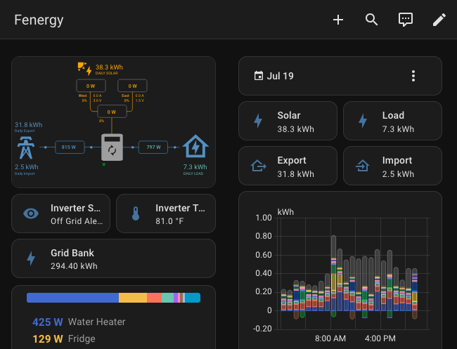
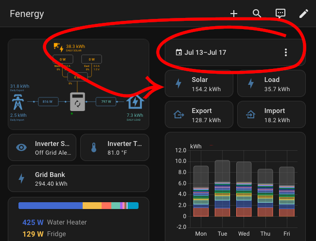

# About

Note: The primary repository is at https://gitlab.com/kobaj/ha_statistics_tile. Please make all pull requests and issues there.

Home Assistant Card that looks like the [Tile Card](https://www.home-assistant.io/dashboards/tile/) with its clean simple information display, but acts like  the [Statistics card](https://www.home-assistant.io/dashboards/statistic/) with the ability to aggregate that information over time. 

|   |   |
|---|---|
||

## Installation

### HACS method (recommended)

This is based on the instructions at

1. Navigate to the HACS ui inside your home assistant instance.
1. Click on the 3 dots in the top right corner.
1. Select "Custom repositories"
1. Add the URL `https://github.com/kobaj/ha_statistics_tile` to the repository.
1. Select `Dashboard` as the type.
1. Click the "ADD" button.
1. Search for "Statistics Tile" in the HACS community store
1. Click "Download"!
1. Restart Home Assistant!

### Manual method (not recommended)

1. On your Home Assistant box, cd into your `config/custom_components` directory
1. Run `git clone git@gitlab.com:kobaj/ha_statistics_tile.git`
1. Restart Home Assistant!

## Setup

The main Config has the following options, all configured via the UI when adding the card.

* `entity` is the entity you want statistics for. Must be an entity with `state_class` equal to either `total` or `total_increasing`.
* `aggregate` is the function you want to use to aggregate the entity metrics for over the selected time period.
* `collection_key` an optional key to connect a collection of energy cards to a particular date picker. If left blank, will use the current dashboard's date picker. The date picker determines the time period used by aggregate.

There is a hidden option called `card` which has all the same sub entities as the `tile` card. So you can do things like set the name of the tile.

There is a second hidden option called `start` and `end` which you can use to specify the time period (via luxon like operations) which the statistics are calculated over. Cannot be used at the same time as collection_key.

```
type: custom:statistics-tile
entity: sensor.inverter_modbus_daily_energy_generated
aggregate: sum
card:
  name: Solar
start:
  - minus:
      days: 30
```
